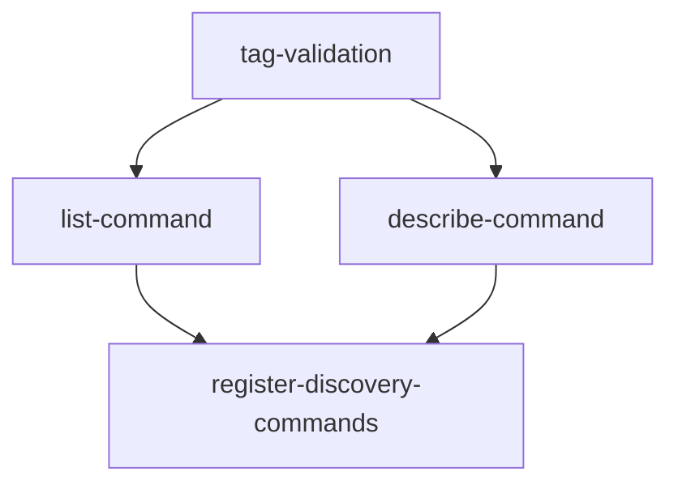

# Implementation Plan: Discovery (Rust)

**Feature ID**: FE-04
**Status**: planned
**Priority**: P1
**Target Language**: Rust 2021
**Source Spec**: `apcore-cli/docs/features/discovery.md`
**SRS Requirements**: FR-DISC-001, FR-DISC-002, FR-DISC-003, FR-DISC-004

---

## Goal

Port the Python `discovery` feature (FE-04) to Rust. The Rust implementation must provide `list` and `describe` as first-class clap subcommands registered on the root CLI, backed by the apcore registry and rendered via the `output` module functions (`format_module_list`, `format_module_detail`, `resolve_format`).

**Correctness invariants that must be preserved across the port:**

- `list` default format: `"table"` on TTY, `"json"` on non-TTY (delegated to `resolve_format`).
- `list --tag` AND semantics: all specified tags must be present on a module for it to match.
- `list --tag` with no matches: exit 0 with `"No modules found matching tags: ..."` or `[]`.
- `describe <id>` not found: stderr `"Error: Module '{id}' not found."`, exit 44.
- `describe <id>` invalid format: exit 2, rejected by clap at parse time.
- `--format yaml` rejected by clap at parse time with exit 2 (not at runtime).
- Optional sections in `describe` table output (input schema, output schema, annotations, x-fields) are omitted when absent.
- `--format` flag uses clap `PossibleValuesParser` — invalid values cause exit 2 before handler runs.

---

## Architecture Design

### Python → Rust Mapping

| Python (click) | Rust (clap v4) |
|----------------|----------------|
| `@cli.command("list")` | `Command::new("list")` added to root via `register_discovery_commands` |
| `@cli.command("describe")` | `Command::new("describe")` added to root |
| `@click.option("--tag", multiple=True)` | `Arg::new("tag").long("tag").action(ArgAction::Append)` |
| `@click.option("--format", type=click.Choice(["table","json"]))` | `Arg::new("format").long("format").value_parser(PossibleValuesParser::new(["table","json"]))` |
| `@click.argument("module_id")` | `Arg::new("module_id").required(true)` (positional) |
| `click.echo(..., err=True); sys.exit(44)` | `eprintln!(...); std::process::exit(EXIT_MODULE_NOT_FOUND)` |
| `sys.exit(2)` on invalid tag format | `eprintln!(...); std::process::exit(EXIT_INVALID_INPUT)` |
| `format_module_list(modules, fmt, filter_tags=tag)` | `format_module_list(&modules, fmt, &filter_tags_slice)` |
| `format_module_detail(module_def, fmt)` | `format_module_detail(&module_json, fmt)` |

### Tag Validation

The Python implementation validates each tag against `^[a-z][a-z0-9_-]*$` and exits 2 on failure. The Rust port replicates this with a `validate_tag` helper in `discovery.rs` that performs the same regex-equivalent character check and calls `std::process::exit(EXIT_INVALID_INPUT)` on failure. This keeps the behaviour identical: invalid tag format → exit 2, non-existent tag → empty result, exit 0.

### Clap v4 Notes

- `--tag` flag: `Arg::new("tag").long("tag").action(ArgAction::Append).value_name("TAG")` collects repeated `--tag foo --tag bar` into `Vec<String>`. Retrieved via `matches.get_many::<String>("tag")`.
- `--format` flag: `Arg::new("format").long("format").value_parser(clap::builder::PossibleValuesParser::new(["table", "json"])).value_name("FORMAT")`. Invalid values (e.g. `--format yaml`) cause clap to print an error and exit 2 at parse time — no runtime check needed.
- `describe` positional: `Arg::new("module_id").required(true)` — clap rejects a missing positional at parse time.

### Registry Interaction Pattern

The current `register_discovery_commands` stub signature is:

```rust
pub fn register_discovery_commands(cli: &mut Command)
```

The full implementation passes the registry via closure capture or a reference. Since the registry is not yet wired (that is `core-dispatcher` scope), the discovery commands call the registry through a passed-in `Arc<dyn Registry>` parameter that the `list_command` and `describe_command` builders capture. For the initial implementation (no live registry), tests use a `MockRegistry` struct that implements a minimal trait interface.

```rust
pub fn register_discovery_commands(
    cli: &mut Command,
    registry: Arc<dyn RegistryProvider>,
)
```

Where `RegistryProvider` is a local trait defined in `discovery.rs`:

```rust
pub trait RegistryProvider: Send + Sync {
    fn list(&self) -> Vec<String>;
    fn get_definition(&self, id: &str) -> Option<serde_json::Value>;
}
```

This mirrors the Python `registry.list()` / `registry.get_definition(id)` calls.

### Module Layout

```
src/
  discovery.rs    — register_discovery_commands, list_command, describe_command,
                    validate_tag, RegistryProvider trait, TAG_PATTERN
tests/
  test_discovery.rs — integration tests (already stubbed, will be fully implemented)
```

No new source files. No `Cargo.toml` changes needed — all required crates (`clap`, `serde_json`, `comfy-table`, `thiserror`, `anyhow`) are already present.

### Key Data-Flow

```
CLI parse
  │
  ├── "list" subcommand match
  │     ├── get tags: matches.get_many("tag") → Vec<String>
  │     ├── validate each tag format → exit 2 on bad format
  │     ├── registry.list() → Vec<String>
  │     ├── registry.get_definition(id) for each → Vec<Value>
  │     ├── filter by tag AND logic
  │     ├── resolve_format(explicit_format) → "table" | "json"
  │     ├── format_module_list(&modules, fmt, &filter_tags)
  │     └── print result to stdout; exit 0
  │
  └── "describe" subcommand match
        ├── get module_id: matches.get_one("module_id")
        ├── validate_module_id(id) → exit 2 on invalid format
        ├── registry.get_definition(id) → None → exit 44
        ├── resolve_format(explicit_format) → "table" | "json"
        ├── format_module_detail(&module_json, fmt)
        └── print result to stdout; exit 0
```

---

## Task Breakdown

### Dependency Graph



### Task List

| Task ID | Title | Estimate |
|---------|-------|----------|
| `tag-validation` | Implement `validate_tag` helper and `RegistryProvider` trait with mock | ~1h |
| `list-command` | Implement `list_command`: clap wiring, tag filter, format dispatch, output | ~2h |
| `describe-command` | Implement `describe_command`: clap wiring, module lookup, exit-44, format dispatch | ~2h |
| `register-discovery-commands` | Wire `list` and `describe` into root CLI; replace all `assert!(false)` stubs in `tests/test_discovery.rs` | ~1.5h |

---

## Risks and Considerations

### Registry Not Yet Wired

**Risk**: The real `apcore::Registry` is not yet instantiated (that is `core-dispatcher` scope). Discovery commands need a registry to function end-to-end.

**Mitigation**: Define a `RegistryProvider` trait in `discovery.rs`. Tests use a `MockRegistry`. The real `apcore::Registry` adaptor is added in the `core-dispatcher` feature when it calls `register_discovery_commands`. This keeps the discovery feature independently testable.

### Clap Subcommand Registration Pattern

**Risk**: `register_discovery_commands` currently takes `&mut Command`. Clap v4 commands are consumed and rebuilt with subcommands via `command.subcommand(sub)`, not mutated in-place. The `&mut Command` pattern works only if using `Command::add` (which does not exist); the correct approach is to return a new `Command`.

**Mitigation**: Change the signature to `fn register_discovery_commands(cli: Command, ...) -> Command` and chain `.subcommand(list_command(...)).subcommand(describe_command(...))`. The caller updates accordingly. This matches the clap v4 builder idiom used throughout the project's existing stubs.

**Alternative**: Keep `&mut Command` and use the `app.find_subcommand_mut` trick — but this is non-idiomatic for clap v4. The returned-command pattern is cleaner and matches the project's existing style in `main.rs`.

### Tag Regex Without `regex` Crate

**Risk**: `validate_tag` requires pattern `^[a-z][a-z0-9_-]*$`. The `regex` crate is not in `Cargo.toml` (same issue noted in `core-dispatcher` plan).

**Mitigation**: Implement `validate_tag` as a hand-written character iterator:
```rust
fn validate_tag(tag: &str) -> bool {
    let mut chars = tag.chars();
    match chars.next() {
        Some(c) if c.is_ascii_lowercase() => {},
        _ => return false,
    }
    chars.all(|c| c.is_ascii_lowercase() || c.is_ascii_digit() || c == '_' || c == '-')
}
```
This avoids adding the `regex` crate for a simple grammar.

### `std::process::exit` in Tests

**Risk**: `describe_command` calls `std::process::exit(44)` on module-not-found, which terminates the test process rather than returning an error to the test harness.

**Mitigation**: Return `Result<(), DiscoveryError>` from the command handlers instead of calling `std::process::exit` directly. The caller (main dispatch) maps the error to the correct exit code. Tests can then assert `Err(DiscoveryError::ModuleNotFound(_))` without process termination. Define `DiscoveryError` via `thiserror`:

```rust
#[derive(Debug, thiserror::Error)]
pub enum DiscoveryError {
    #[error("module '{0}' not found")]
    ModuleNotFound(String),
    #[error("invalid module id: {0}")]
    InvalidModuleId(String),
    #[error("invalid tag format: '{0}'")]
    InvalidTag(String),
}
```

The binary entry point converts `DiscoveryError` to the correct exit code.

### TTY Detection in Tests

**Risk**: `resolve_format(None)` returns `"json"` in test runners (non-TTY). Tests for the TTY-default-table path cannot be asserted from inside `cargo test`.

**Mitigation**: Covered by the `output-formatter` feature's `resolve_format_inner(explicit_format, is_tty)` pattern. Discovery tests pass explicit `--format table` or `--format json` to avoid relying on TTY detection.

---

## Acceptance Criteria

All acceptance criteria from the Python feature spec (FE-04) apply, verified via `cargo test`.

| Test ID | Description | Expected |
|---------|-------------|----------|
| T-DISC-01 | `list` with 2 modules registered | Table output with both IDs; exit 0 |
| T-DISC-02 | `list` with empty registry | `"No modules found."`; exit 0 |
| T-DISC-03 | `list --tag math` | Only math-tagged modules |
| T-DISC-04 | `list --tag math --tag core` | Only modules with BOTH tags (AND logic) |
| T-DISC-05 | `list --tag nonexistent` | `"No modules found matching tags: nonexistent."`; exit 0 |
| T-DISC-06 | `list --format json` | Valid JSON array |
| T-DISC-07 | `list` in non-TTY | JSON output by default |
| T-DISC-08 | `list --format table` in non-TTY | Table output (flag overrides TTY detection) |
| T-DISC-09 | `describe math.add` | Full metadata output; exit 0 |
| T-DISC-10 | `describe non.existent` | stderr contains "not found"; exit 44 |
| T-DISC-11 | `describe math.add --format json` | JSON object with all metadata |
| T-DISC-12 | Module with 120-char description in `list` | Truncated to 80 chars + `"..."` |
| T-DISC-13 | Module without `output_schema` in `describe` | Output Schema section absent |
| T-DISC-14 | Module without annotations in `describe` | Annotations section absent |
| T-DISC-15 | `list --format yaml` | Clap rejects; exit 2 |
| T-DISC-16 | `list --tag INVALID!` | `"Error: Invalid tag format"`; exit 2 |
| T-DISC-17 | `register_discovery_commands` called | Root has `list` and `describe` subcommands |

Additional Rust-specific criteria:

- `cargo test` passes with zero `assert!(false, "not implemented")` assertions in `src/discovery.rs` and `tests/test_discovery.rs`.
- `cargo clippy -- -D warnings` produces no warnings in `src/discovery.rs`.
- `cargo build --release` succeeds.

---

## References

- Feature spec: `/Users/tercel/WorkSpace/aiperceivable/apcore-cli/docs/features/discovery.md`
- Python implementation: `/Users/tercel/WorkSpace/aiperceivable/apcore-cli-python/src/apcore_cli/discovery.py`
- Python planning: `/Users/tercel/WorkSpace/aiperceivable/apcore-cli-python/planning/discovery.md`
- Type mapping spec: `/Users/tercel/WorkSpace/aiperceivable/apcore/docs/spec/type-mapping.md`
- Output formatter plan: `/Users/tercel/WorkSpace/aiperceivable/apcore-cli-rust/planning/output-formatter/plan.md`
- Core dispatcher plan: `/Users/tercel/WorkSpace/aiperceivable/apcore-cli-rust/planning/core-dispatcher/plan.md`
- Existing stub: `/Users/tercel/WorkSpace/aiperceivable/apcore-cli-rust/src/discovery.rs`
- Existing test stub: `/Users/tercel/WorkSpace/aiperceivable/apcore-cli-rust/tests/test_discovery.rs`
- `clap` v4 docs: https://docs.rs/clap/latest/clap/
- `comfy-table` v7 docs: https://docs.rs/comfy-table/latest/comfy_table/
