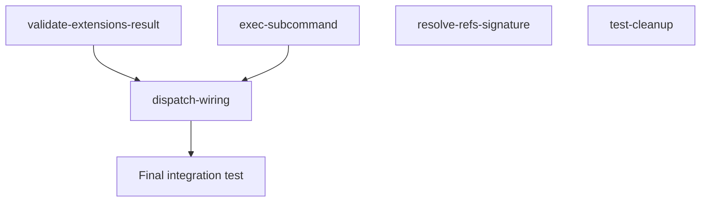

# Dispatch Integration Plan

## Goal

Wire the dynamic module dispatch pipeline end-to-end so that:

1. External subcommands (any command not matched by a built-in) route through `cli::dispatch_module`.
2. An explicit `exec` subcommand is registered, providing a named entry point for module execution.
3. Code quality issues identified during review are resolved: test-only types gated behind `#[cfg(test)]`, function signatures tightened, dead code removed, and `process::exit` calls replaced with `Result` returns.

## Architecture Design

### Current State

- `main.rs` catches external subcommands but prints "not yet implemented" and exits 44.
- `cli.rs` exposes `dispatch_module(module_id, matches, registry, executor, apcore_executor) -> !` -- fully implemented but never called.
- `shell.rs` lists `"exec"` in `KNOWN_BUILTINS` and generates man pages for it, but no `exec` subcommand is registered in the clap command tree.
- `discovery.rs` exposes `MockRegistry` and `mock_module` unconditionally (not gated behind `#[cfg(test)]`).
- `ref_resolver.rs` takes `&mut Value` but immediately clones it; should take `&Value`.
- `tests/common/mod.rs` defines helpers (`sample_module_descriptor`, `sample_module_with_schema`, `sample_exec_result`, `strip_apcore_env_vars`) that are never called from any test file.
- `tests/test_schema_parser.rs` imports `SchemaArgs` but never uses it.
- `validate_extensions_dir` calls `process::exit` directly instead of returning `Result`.

### Target State

```
argv
  |
  v
build_cli_command()
  |-- list, describe, completion, man  (existing)
  |-- exec <MODULE_ID> [flags]         (NEW subcommand)
  |-- <external>                       (allow_external_subcommands)
  v
match subcommand
  |-- "exec"     --> dispatch_module(module_id, ...)
  |-- (external) --> dispatch_module(external, ...)
  |-- None       --> print help
```

## Task Breakdown

### Dependency Graph



### Task Table

| Task ID                     | Title                                         | Dependencies              | Est. Time |
|-----------------------------|-----------------------------------------------|---------------------------|-----------|
| validate-extensions-result  | validate_extensions_dir returns Result         | none                      | ~30min    |
| exec-subcommand             | Register exec subcommand in clap tree         | none                      | ~45min    |
| dispatch-wiring             | Wire external + exec to dispatch_module       | validate-extensions-result, exec-subcommand | ~60min |
| resolve-refs-signature      | Change &mut Value to &Value in resolve_refs    | none                      | ~20min    |
| test-cleanup                | Gate MockRegistry, remove dead test code       | none                      | ~20min    |

## Risks

1. **`dispatch_module` is divergent (`-> !`)** -- it calls `process::exit`. The external subcommand match arm and exec arm must both pass ownership of the tokio runtime correctly. No code runs after `dispatch_module`.
2. **`validate_extensions_dir` returning `Result` changes `build_cli_command` / `create_cli` signatures** -- callers in `main()` must be updated to handle the error. The `build_cli_command` function currently has `validate: bool` to skip validation for completions/man pages; the `Result` path only applies when `validate == true`.
3. **`MockRegistry` is re-exported from `lib.rs`** at crate root via `pub use discovery::{mock_module, MockRegistry}` -- gating it behind `#[cfg(test)]` in `discovery.rs` requires also gating (or removing) the re-export in `lib.rs`. Integration tests that use `MockRegistry` must import it from `apcore_cli::discovery::MockRegistry` under `#[cfg(test)]`.
4. **`resolve_refs` signature change is a public API break** -- all callers (internal and in tests) must be updated. Since the function clones the input immediately, this is purely a signature tightening with no behavioral change.

## Acceptance Criteria

1. `cargo test` passes with all existing tests plus any new tests added.
2. `cargo clippy -- -D warnings` produces no warnings.
3. Running `apcore-cli exec math.add --a 1 --b 2` (with a valid extensions dir and registry) invokes `dispatch_module`.
4. Running `apcore-cli some.unknown.module` invokes `dispatch_module` (not the "not yet implemented" stub).
5. `MockRegistry` and `mock_module` are only compiled in test builds.
6. `resolve_refs` accepts `&Value` (not `&mut Value`).
7. `validate_extensions_dir` returns `Result<(), String>` and no longer calls `process::exit`.
8. No unused imports or dead helper functions remain in test files.

## References

- `src/main.rs` -- binary entry point, CLI construction, subcommand dispatch
- `src/cli.rs` -- `dispatch_module`, `LazyModuleGroup`, `validate_module_id`
- `src/discovery.rs` -- `RegistryProvider`, `MockRegistry`, `mock_module`
- `src/ref_resolver.rs` -- `resolve_refs`
- `src/shell.rs` -- `register_shell_commands`, `KNOWN_BUILTINS`
- `src/lib.rs` -- public API re-exports
- `tests/common/mod.rs` -- unused shared helpers
- `tests/test_schema_parser.rs` -- unused `SchemaArgs` import
