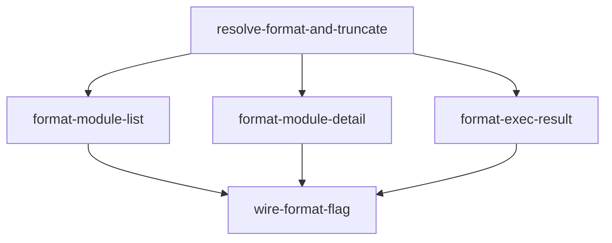

# Implementation Plan: Output Formatter (Rust)

**Feature ID**: FE-08
**Status**: planned
**Priority**: P1
**Target Language**: Rust 2021
**Source Spec**: `apcore-cli/docs/features/output-formatter.md`
**SRS Requirements**: FR-DISC-004, FR-DISC-001, FR-DISC-003

---

## Goal

Port the Python `output-formatter` feature (FE-08) to Rust. The Rust implementation must provide the same external contract as the Python version: TTY-adaptive format selection, table rendering for module lists and detail views, JSON rendering, and execution result formatting — all implemented using idiomatic Rust with the project's declared tech stack (Rust 2021, `serde_json`, `comfy-table`, `std::io::IsTerminal`, `thiserror`, `anyhow`).

**Correctness invariants that must be preserved across the port:**

- `resolve_format(None)` returns `"table"` on a TTY, `"json"` on a non-TTY.
- `resolve_format(Some(x))` always returns `x`, regardless of TTY state.
- Description truncation: strings longer than 80 chars are truncated to 77 chars + `"..."`.
- `format_module_list` with zero modules in `"table"` format prints `"No modules found."` (or the filter-tag variant) and an empty JSON array `[]` in `"json"` format.
- `format_exec_result` matches on `serde_json::Value` variants: `Object` → key-value table (in `"table"` format) or JSON, `Array` → JSON, `String` → plain, `Null` → no output, other scalars → `to_string()`.
- All functions return `String` (the formatted output), not `()`. Callers print to stdout. This is a deliberate departure from the Python `click.echo` pattern; it makes functions testable without capturing stdout.

---

## Architecture Design

### Python → Rust Mapping

| Python | Rust |
|--------|------|
| `rich.table.Table` | `comfy_table::Table` |
| `rich.panel.Panel` | ASCII border printed via a simple helper |
| `rich.syntax.Syntax` (JSON highlight) | Plain pretty-printed JSON (no syntax highlight; `comfy-table` has no syntax coloring) |
| `sys.stdout.isatty()` | `std::io::stdout().is_terminal()` (stable since Rust 1.70) |
| `click.echo(...)` | functions return `String`; callers print |
| `json.dumps(result, default=str)` | `serde_json::to_string_pretty` with non-serializable values already impossible for `serde_json::Value` |

### Function Signatures

```rust
// src/output.rs

/// Resolve output format: explicit override wins; otherwise TTY-adaptive.
pub fn resolve_format(explicit_format: Option<&str>) -> &'static str

/// Truncate text to max_length (77 + "..." if over 80).
fn truncate(text: &str, max_length: usize) -> String

/// Render a list of module descriptors. Returns formatted String.
pub fn format_module_list(
    modules: &[Value],
    format: &str,
    filter_tags: &[&str],
) -> String

/// Render a single module descriptor with full metadata. Returns formatted String.
pub fn format_module_detail(module: &Value, format: &str) -> String

/// Render an execution result. Returns formatted String.
pub fn format_exec_result(result: &Value, format: &str) -> String
```

### `format_module_list` signature change

The Python signature is `format_module_list(modules, format, filter_tags=())`. The existing Rust stub is `format_module_list(modules: &[Value], format: &str) -> String` with no `filter_tags` parameter. This task adds `filter_tags: &[&str]` as a third parameter (defaulting to `&[]` at call sites), matching the Python contract.

### `format_exec_result` TTY logic

The Python `format_exec_result` calls `resolve_format(format)` internally to handle `None`. The Rust version accepts a resolved `&str` format (callers invoke `resolve_format` first). This avoids lifetime complexity inside the function.

### Module Layout

```
src/
  output.rs     — all four public functions + truncate helper
tests/
  test_output.rs — integration tests (already stubbed, will be fully implemented)
```

No new files are required. `comfy-table = "7"` is already present in `Cargo.toml`.

### Key Data-Flow

```
CLI command match
  │
  ├── resolve_format(explicit_format)   → "table" | "json"
  │
  ├── format_module_list(modules, fmt, tags)
  │     ├── "table": comfy_table::Table { cols: [ID, Description, Tags] }
  │     │             truncate(description, 80) per row
  │     └── "json":  serde_json::to_string_pretty(array of {id, description, tags})
  │
  ├── format_module_detail(module, fmt)
  │     ├── "table": header box + Description + Input Schema + Output Schema
  │     │             + Annotations + Extension Metadata + Tags
  │     └── "json":  serde_json::to_string_pretty(filtered non-null fields)
  │
  └── format_exec_result(result, fmt)
        ├── Value::Null   → empty string
        ├── Value::String → raw string value
        ├── Value::Object + "table" → comfy_table key/value table
        ├── Value::Object + "json"  → serde_json::to_string_pretty
        ├── Value::Array  → serde_json::to_string_pretty
        └── scalar        → value.to_string()
```

---

## Task Breakdown

### Dependency Graph



### Task List

| Task ID | Title | Estimate |
|---------|-------|----------|
| `resolve-format-and-truncate` | Implement `resolve_format` (TTY detection) and `truncate` helper | ~1h |
| `format-module-list` | Implement `format_module_list` for table and JSON modes, with empty-list messages and tag-filter messages | ~2h |
| `format-module-detail` | Implement `format_module_detail` for table (multi-section) and JSON modes | ~2h |
| `format-exec-result` | Implement `format_exec_result` matching on `serde_json::Value` variants | ~1.5h |
| `wire-format-flag` | Update `discovery.rs` `list_command` and `describe_command` to call the output functions; update `tests/test_output.rs` stubs to full passing tests | ~1.5h |

---

## Risks and Considerations

### TTY Detection in Tests

**Risk**: `std::io::stdout().is_terminal()` returns `false` in CI and in `cargo test`, so `resolve_format(None)` always returns `"json"` in tests. Tests for the `None` + TTY path cannot assert `"table"` from within a normal test runner invocation.

**Mitigation**: Inject a `bool` parameter `is_tty: bool` into a private `resolve_format_inner(explicit_format: Option<&str>, is_tty: bool) -> &'static str`. The public `resolve_format` calls `resolve_format_inner` with the real TTY detection. Tests call `resolve_format_inner` directly with a controlled `is_tty` value. This is the standard Rust pattern for platform-dependent singletons.

### `comfy-table` Panel Equivalent

**Risk**: `comfy-table` is a table library; it has no `Panel` equivalent for rendering a titled box around a single line (Python uses `rich.panel.Panel`).

**Mitigation**: Implement a minimal `print_panel(title: &str) -> String` helper that builds a single-row `comfy_table::Table` with one column and the title as its sole cell, configured with a box border style. This produces a visually similar bordered title block. No new dependency needed.

### `format_module_list` signature change

**Risk**: The existing stub `format_module_list(modules: &[Value], format: &str) -> String` omits `filter_tags`. Adding the parameter is a breaking change to the stub signature and to the call in `tests/test_output.rs`.

**Mitigation**: Add `filter_tags: &[&str]` as the third parameter. Update all call sites in `tests/test_output.rs` and any future discovery command wiring. The parameter defaults to `&[]` at all current call sites.

### `serde_json::Value` Serialization

**Risk**: The Python implementation uses `json.dumps(result, default=str)` as a fallback for non-serializable objects. In Rust, `serde_json::Value` is always serializable by construction; there is no equivalent non-serializable case.

**Mitigation**: Use `serde_json::to_string_pretty` directly; no fallback needed. Document this difference in `format_exec_result`'s doc comment.

### No Syntax Highlighting

**Risk**: The Python `format_module_detail` uses `rich.syntax.Syntax` for syntax-highlighted JSON in the `"table"` format. `comfy-table` provides no syntax highlighting.

**Mitigation**: Print pretty-printed JSON as plain text in the `"table"` format. The `NO_COLOR=1` parity requirement from the spec is automatically satisfied. If syntax highlighting is required in a future iteration, the `syntect` crate can be added.

---

## Acceptance Criteria

All acceptance criteria from the Python feature spec apply, verified via `cargo test`.

| Test ID | Description | Expected |
|---------|-------------|----------|
| T-OUT-01 | `resolve_format_inner(None, true)` | Returns `"table"` |
| T-OUT-02 | `resolve_format_inner(None, false)` | Returns `"json"` |
| T-OUT-03 | `resolve_format(Some("json"))` in any TTY state | Returns `"json"` |
| T-OUT-04 | `format_module_list` with 2 modules, `"table"` | Output contains both module IDs and column headers |
| T-OUT-05 | `format_module_list` with 0 modules, `"table"` | Output is `"No modules found."` |
| T-OUT-06 | `format_module_list` with 0 modules and filter tags, `"table"` | Output contains `"No modules found matching tags:"` |
| T-OUT-07 | `format_module_list` with modules, `"json"` | Valid JSON array with `id`, `description`, `tags` fields |
| T-OUT-08 | `format_module_list` with 0 modules, `"json"` | Output is `"[]"` |
| T-OUT-09 | `format_module_detail` with full metadata, `"table"` | Output contains description, `Input Schema:`, `Output Schema:`, `Annotations:`, `Tags:` |
| T-OUT-10 | `format_module_detail` with no `output_schema`, `"table"` | `Output Schema:` section absent |
| T-OUT-11 | `format_module_detail` with full metadata, `"json"` | Valid JSON with `id`, `description`, `input_schema`, `output_schema`, `tags` |
| T-OUT-12 | `format_exec_result` with `Value::Object`, `"json"` | Valid pretty-printed JSON |
| T-OUT-13 | `format_exec_result` with `Value::Object`, `"table"` | Output contains keys and values |
| T-OUT-14 | `format_exec_result` with `Value::Array` | JSON array output |
| T-OUT-15 | `format_exec_result` with `Value::String` | Raw string value |
| T-OUT-16 | `format_exec_result` with `Value::Null` | Empty string |
| T-OUT-17 | Description truncation at 80 chars | 77 chars + `"..."` for text longer than 80 chars |

Additional Rust-specific criteria:

- `cargo test` passes with zero `assert!(false, "not implemented")` assertions in `tests/test_output.rs` and `src/output.rs`.
- `cargo clippy -- -D warnings` produces no warnings in `src/output.rs`.
- `cargo build --release` succeeds.

---

## References

- Feature spec: `/Users/tercel/WorkSpace/aiperceivable/apcore-cli/docs/features/output-formatter.md`
- Python implementation: `/Users/tercel/WorkSpace/aiperceivable/apcore-cli-python/src/apcore_cli/output.py`
- Python planning: `/Users/tercel/WorkSpace/aiperceivable/apcore-cli-python/planning/output-formatter.md`
- Type mapping spec: `/Users/tercel/WorkSpace/aiperceivable/apcore/docs/spec/type-mapping.md`
- Existing stub: `/Users/tercel/WorkSpace/aiperceivable/apcore-cli-rust/src/output.rs`
- Existing test stub: `/Users/tercel/WorkSpace/aiperceivable/apcore-cli-rust/tests/test_output.rs`
- `comfy-table` docs: https://docs.rs/comfy-table/latest/comfy_table/
- `std::io::IsTerminal` docs: https://doc.rust-lang.org/std/io/trait.IsTerminal.html
