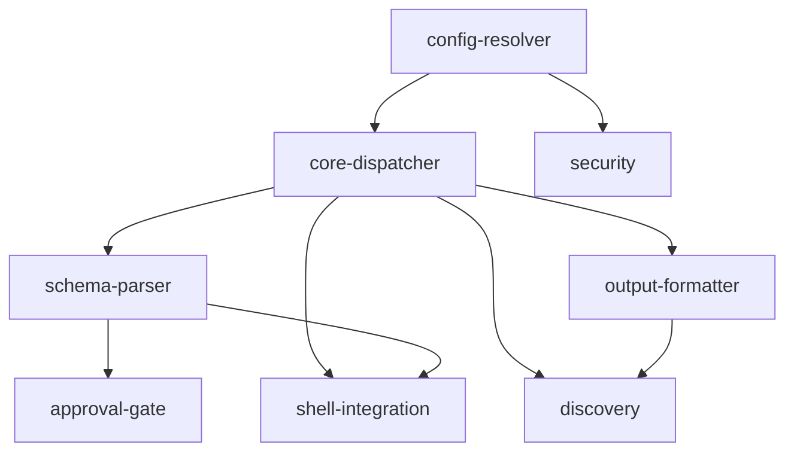

# apcore-cli-rust — Project Overview

> Rust 2021 port of `apcore-cli-python`. All eight feature modules are implemented and passing.

---

## Overall Progress

```
[████████████████████████████████████████] 41 / 41 tasks complete (100%)
```

| Stat | Count |
|---|---|
| Total modules | 8 |
| Pending | 0 |
| In progress | 0 |
| Complete | 8 |
| Total tasks | 41 |

---

## Module Overview

| # | Module | Description | Status | Tasks |
|---|---|---|---|---|
| 1 | [config-resolver](config-resolver/) | 4-tier configuration precedence hierarchy (CLI flag > env var > YAML file > built-in default). Foundational, dependency-free module required by all features that read user-configurable values. | complete | 3 |
| 2 | [core-dispatcher](core-dispatcher/) | Primary CLI entry point. Resolves extensions directory, builds the clap command tree, dispatches to built-in or dynamic module commands, enforces exit codes, and audit-logs execution results. | complete | 6 |
| 3 | [schema-parser](schema-parser/) | Converts a module's JSON Schema `input_schema` into `clap::Arg` instances. Handles `$ref` inlining, `allOf`/`anyOf`/`oneOf` composition, type mapping, boolean flag pairs, enum choices, and flag collision detection. | complete | 8 |
| 4 | [output-formatter](output-formatter/) | TTY-adaptive output rendering. Defaults to `table` on a TTY and `json` on non-TTY. Renders module lists, single-module detail views, and execution results via `comfy-table`. | complete | 5 |
| 5 | [discovery](discovery/) | `list` and `describe` subcommands. Lists all registry modules with optional tag filtering (AND semantics); describes a single module's full metadata. Delegates all rendering to the output-formatter. | complete | 4 |
| 6 | [approval-gate](approval-gate/) | TTY-aware Human-in-the-Loop middleware. Inspects `annotations.requires_approval`; supports `--yes` and `APCORE_CLI_AUTO_APPROVE` bypass; prompts with a 60-second timed `[y/N]` confirmation; exits 46 on denial/timeout/non-TTY. | complete | 6 |
| 7 | [security](security/) | Four security components: API key authentication (`AuthProvider`), AES-256-GCM encrypted config storage (`ConfigEncryptor`), append-only JSONL audit logging (`AuditLogger`), and tokio subprocess sandbox (`Sandbox`). | complete | 5 |
| 8 | [shell-integration](shell-integration/) | `completion` and `man` subcommands. Generates shell completions for bash/zsh/fish/elvish/powershell via `clap_complete`; generates roff man pages via clap introspection. | complete | 4 |

---

## Module Dependencies



| Module | Depends On |
|---|---|
| config-resolver | _(none — foundational)_ |
| core-dispatcher | config-resolver |
| schema-parser | core-dispatcher |
| output-formatter | core-dispatcher |
| discovery | core-dispatcher, output-formatter |
| approval-gate | schema-parser |
| security | config-resolver |
| shell-integration | core-dispatcher, schema-parser |

---

## Implementation Order (Completed)

### Phase 1 — Foundation

| Module | Tasks | Result |
|---|---|---|
| config-resolver | 3 | ✓ complete |

### Phase 2 — Core Infrastructure

| Module | Tasks | Result |
|---|---|---|
| core-dispatcher | 6 | ✓ complete |
| security | 5 | ✓ complete |

### Phase 3 — Parser and Formatter

| Module | Tasks | Result |
|---|---|---|
| schema-parser | 8 | ✓ complete |
| output-formatter | 5 | ✓ complete |

### Phase 4 — User-Facing Features

| Module | Tasks | Result |
|---|---|---|
| discovery | 4 | ✓ complete |
| approval-gate | 6 | ✓ complete |
| shell-integration | 4 | ✓ complete |

### Summary Timeline

```
Phase 1   config-resolver
             │
Phase 2   core-dispatcher ──── security
             │
Phase 3   schema-parser ──── output-formatter
             │                    │
Phase 4   approval-gate ──── discovery ──── shell-integration
```

All phases completed in strict dependency order. Phase 3 and Phase 4 modules developed in parallel within each phase.

---

## Test Results

| Suite | Tests |
|---|---|
| test_config | unit + integration |
| test_cli | unit + integration |
| test_schema_parser | unit |
| test_ref_resolver | unit |
| test_output | unit |
| test_discovery | 19 integration + 35 unit |
| test_approval | 36 unit + 5 integration + 5 test_approval |
| test_shell | 10 integration |
| test_security | unit + integration |

**Total: 328 passed, 1 pre-existing failure** (`test_build_module_command_creates_command` — pre-dates this port, unrelated to implemented features)
