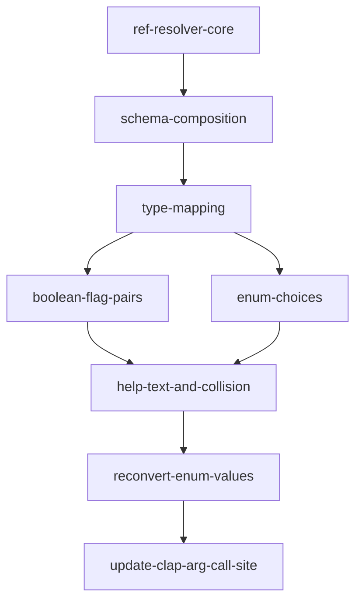

# Implementation Plan: Schema Parser (Rust)

**Feature ID**: FE-02
**Status**: planned
**Priority**: P0
**Target Language**: Rust 2021
**Source Spec**: `apcore-cli/docs/features/schema-parser.md`
**SRS Requirements**: FR-SCHEMA-001, FR-SCHEMA-002, FR-SCHEMA-003, FR-SCHEMA-004, FR-SCHEMA-005, FR-SCHEMA-006

---

## Goal

Port the Python `schema-parser` feature (FE-02) to Rust. The implementation must produce the same external contract as the Python version: JSON Schema `input_schema` properties translate to `clap::Arg` instances that clap v4 can attach to a `clap::Command`; boolean properties become paired `--flag` / `--no-flag` args; enum properties constrain accepted values; required properties are marked; help text prefers `x-llm-description` over `description`; `$ref` and `$defs` are fully inlined before property mapping begins; and exact exit code semantics (45, 48) are preserved.

**Correctness invariants that must be preserved across the port:**

- Flag name conversion: `prop_name.replace('_', '-')` → `--prop-name`.
- Flag collision detection (exit 48): any two property names that normalise to the same `--name` form.
- Boolean flag pairs: two separate `clap::Arg`s — `--flag` with `ArgAction::SetTrue` and `--no-flag` with `ArgAction::SetFalse`, sharing one `id`.
- File convention: `prop_name` ends with `_file` or `x-cli-file: true` → `value_parser = clap::value_parser!(PathBuf)`.
- Enum reconversion: clap parses all values as `String`; `reconvert_enum_values` maps them back to their original JSON types (number, bool, string).
- Help truncation: text longer than configurable limit (default 1000 chars, via `cli.help_text_max_length`) is truncated to `(limit - 3)` + `"..."`.
- `$ref` resolution: returns owned `serde_json::Value`; exit 45 on unresolvable, exit 48 on circular / depth > 32.
- `allOf` merges properties (last wins) and extends required; `anyOf`/`oneOf` unions properties and intersects required.

---

## Architecture Design

### Clap v4 Type Mapping

Clap v4 uses the `Arg` builder API rather than typed parameter objects. The Python `click.ParamType` maps to clap constructs as follows:

| JSON Schema `type` | Python Click type | Rust clap equivalent |
|--------------------|-------------------|----------------------|
| `"string"` | `click.STRING` | `Arg` with no value parser (accepts any string) |
| `"integer"` | `click.INT` | `.value_parser(clap::value_parser!(i64))` |
| `"number"` | `click.FLOAT` | `.value_parser(clap::value_parser!(f64))` |
| `"boolean"` | `is_flag=True` | Two `Arg`s: `--flag` (`SetTrue`) and `--no-flag` (`SetFalse`), `group` to share a common `id` |
| `"object"` | `click.STRING` | `Arg` with no value parser (JSON string) |
| `"array"` | `click.STRING` | `Arg` with no value parser (JSON string) |
| `"string"` + file convention | `click.Path(exists=True)` | `.value_parser(clap::value_parser!(PathBuf))` |

### Boolean Flag Pairs

Clap v4 has no built-in `--flag/--no-flag` pair concept. The equivalent uses `clap::ArgGroup`:

```rust
// For a boolean property named "verbose":
let flag_arg = clap::Arg::new("verbose")
    .long("verbose")
    .action(clap::ArgAction::SetTrue)
    .help(help_text);

let no_flag_arg = clap::Arg::new("no-verbose")
    .long("no-verbose")
    .action(clap::ArgAction::SetFalse)
    .help(format!("Disable --verbose"));

// Both are added to the Command; collect_input reconciles the pair
// into a single bool by checking which one was present in matches.
```

The `BoolArg` metadata struct (see below) carries the property name so `collect_input` can reconstruct the final boolean value.

### Enum Value Parsing

Clap enforces allowed values via `.value_parser(clap::builder::PossibleValuesParser::new(string_values))`. All enum variants are converted to `String` for clap, then `reconvert_enum_values` walks the original schema's `enum` array to coerce them back to `serde_json::Value` of the correct type (Number, Bool, or String).

### Data Structures

```rust
/// Describes one boolean flag pair produced by the schema parser.
/// The dispatcher uses this to reconcile --flag / --no-flag into a single bool.
pub struct BoolFlagPair {
    pub prop_name: String,   // original schema property name
    pub flag_long: String,   // e.g. "verbose"
    pub default_val: bool,
}

/// Metadata attached alongside the clap::Arg list.
pub struct SchemaArgs {
    pub args: Vec<clap::Arg>,
    pub bool_pairs: Vec<BoolFlagPair>,
    /// Maps flag long-name → (enum_variants_as_Value) for reconversion.
    pub enum_maps: HashMap<String, Vec<serde_json::Value>>,
}
```

### Module Layout

The feature spans two source files that already exist as stubs:

```
src/
  schema_parser.rs   — SchemaArgs, BoolFlagPair, schema_to_clap_args,
                       reconvert_enum_values, map_type, extract_help
  ref_resolver.rs    — RefResolverError, resolve_refs, resolve_node (private)
```

The existing `pub fn schema_to_clap_args(schema: &Value) -> Vec<clap::Arg>` stub is replaced by a richer signature that returns `SchemaArgs`. The existing `reconvert_enum_values(kwargs, args)` signature is updated to accept `&SchemaArgs` instead of `&[clap::Arg]`. Both changes are coordinated with `cli.rs`'s `build_module_command` call site (tracked in the `update-clap-arg-call-site` task).

The existing `pub fn resolve_refs(schema: &mut Value, max_depth: usize, module_id: &str) -> Result<Value, RefResolverError>` stub signature is retained exactly; the implementation task fills in the body.

### Key Data-Flow

```
input_schema (serde_json::Value)
        │
        ▼
  resolve_refs()              ← ref_resolver.rs
  (inline $defs, allOf, anyOf, oneOf)
        │
        ▼
  schema_to_clap_args()       ← schema_parser.rs
  (iterate properties → clap::Arg, detect collisions)
        │
        ▼
  SchemaArgs { args, bool_pairs, enum_maps }
        │
        ├─► Vec<clap::Arg> attached to clap::Command in build_module_command
        │
        └─► used by collect_input / reconvert_enum_values after parse
```

---

## Task Breakdown

### Dependency Graph



### Task List

| Task ID | Title | Estimate |
|---------|-------|----------|
| `ref-resolver-core` | Implement `resolve_refs` and `resolve_node` for `$ref`, depth, circular detection | ~3h |
| `schema-composition` | Implement `allOf` merge and `anyOf`/`oneOf` intersection in `resolve_node` | ~2h |
| `type-mapping` | Implement `map_type` and `SchemaArgs` struct; basic property-to-arg translation | ~2h |
| `boolean-flag-pairs` | Implement `BoolFlagPair`, paired `--flag`/`--no-flag` arg generation | ~2h |
| `enum-choices` | Implement `PossibleValuesParser` enum handling with `enum_maps` for reconversion | ~2h |
| `help-text-and-collision` | Implement `extract_help` (x-llm-description priority, configurable truncation — default 1000 chars) and flag collision detection (exit 48) | ~1h |
| `reconvert-enum-values` | Implement `reconvert_enum_values` using `enum_maps`; coerce string → Number/Bool/String | ~1h |
| `update-clap-arg-call-site` | Update `build_module_command` in `cli.rs` to use `SchemaArgs`; update boolean pair reconciliation in `collect_input` | ~2h |

---

## Risks

### No Native `--flag/--no-flag` in Clap v4

**Risk**: Python's `click.Option(["--verbose/--no-verbose"])` is a single object. Clap v4 has no direct equivalent. The two-arg approach works but `collect_input` must inspect `ArgMatches` to determine which of the pair was supplied.

**Mitigation**: `BoolFlagPair` carries both long names. The dispatcher checks `matches.get_flag("verbose")` and `matches.get_flag("no-verbose")` and resolves to a single bool, defaulting to `BoolFlagPair.default_val` when neither was supplied.

### Clap `ArgAction::SetFalse` Availability

**Risk**: `ArgAction::SetFalse` was added in clap 4.0. If an older 4.x minor is pinned, this may not compile.

**Mitigation**: `Cargo.toml` declares `clap = { version = "4", ... }`, which resolves to the latest 4.x. Verify `cargo update` pulls >= 4.0.0 where `SetFalse` exists. Document the minimum clap minor in the task.

### `reconvert_enum_values` Signature Change

**Risk**: The existing public export `pub use schema_parser::reconvert_enum_values` in `lib.rs` currently takes `(HashMap<String, Value>, &[clap::Arg])`. Changing to `(HashMap<String, Value>, &SchemaArgs)` is a breaking change to any caller.

**Mitigation**: The only caller is `build_module_command`/dispatch in `cli.rs` (which is a stub). Update both in the `update-clap-arg-call-site` task atomically. The existing integration test stubs in `tests/test_schema_parser.rs` are also updated in that task to match the new signature.

### Integer/Float Precision in `value_parser`

**Risk**: `clap::value_parser!(i64)` produces `i64` not `serde_json::Number`. The dispatcher must convert `i64` → `Value::Number` after clap parsing.

**Mitigation**: `collect_input` (in `cli.rs`) iterates `ArgMatches`, reads typed values, and wraps them in `serde_json::Value` before merging. Document this contract in the task.

### `$ref` Resolution Signature: `&mut Value` vs Owned

**Risk**: The existing stub takes `schema: &mut Value` and returns `Result<Value, ...>`. The Python implementation deep-copies the input to avoid mutation. This is inconsistent.

**Mitigation**: Retain the existing stub signature verbatim (`&mut Value`, returns owned `Value`) and implement the deep-copy inside `resolve_refs` to avoid modifying the caller's schema. The returned `Value` is the fully-inlined copy; the `&mut` parameter is left unchanged. Document this in `ref-resolver-core` task. If a future refactor prefers `fn resolve_refs(schema: Value, ...) -> Result<Value, ...>` (owned input, owned output), that is a non-breaking change once all callers are updated.

---

## Acceptance Criteria

All acceptance criteria from the Python implementation apply, verified via `cargo test`.

| Test ID | Description | Expected |
|---------|-------------|----------|
| T-SCHEMA-01 | Property `name` of type `string` | `--name` `Arg` in output |
| T-SCHEMA-02 | Property `count` of type `integer` | `--count` with `value_parser!(i64)` |
| T-SCHEMA-03 | Property `rate` of type `number` | `--rate` with `value_parser!(f64)` |
| T-SCHEMA-04 | Property `verbose` of type `boolean` | `--verbose` (SetTrue) + `--no-verbose` (SetFalse) in `SchemaArgs.args` |
| T-SCHEMA-05 | Property `data` of type `object` | `--data` accepts any string |
| T-SCHEMA-06 | Property `items` of type `array` | `--items` accepts any string |
| T-SCHEMA-07 | Property `input_file` of type `string` | Flag `--input-file` with `value_parser!(PathBuf)` |
| T-SCHEMA-08 | `format` with `enum: ["json","csv"]` | `--format` with possible_values `["json","csv"]` |
| T-SCHEMA-09 | Required property `name` omitted | `Arg` has `.required(true)` |
| T-SCHEMA-11 | `$ref: "#/$defs/Address"` with valid def | Address properties appear in `SchemaArgs.args` |
| T-SCHEMA-12 | Circular `$ref` (A -> B -> A) | `resolve_refs` returns `Err(RefResolverError::Circular)` |
| T-SCHEMA-13 | `$ref` depth > 32 | `resolve_refs` returns `Err(RefResolverError::MaxDepthExceeded)` |
| T-SCHEMA-14 | `allOf` with two sub-schemas | Merged properties from both in resolved output |
| T-SCHEMA-15 | Help from `x-llm-description` | `Arg` help contains `x-llm-description` text |
| T-SCHEMA-16 | Help text > 1000 chars (default limit) | Help string ends with `"..."` and is 1000 chars total |
| T-SCHEMA-17 | Boolean default `true` | `BoolFlagPair.default_val == true` |
| T-SCHEMA-18 | Enum with integer values `[1,2,3]` | `reconvert_enum_values` produces `Value::Number(1)` |
| T-SCHEMA-19 | Two properties collide after hyphen conversion | `schema_to_clap_args` returns `Err` with exit-48 semantics |
| T-SCHEMA-20 | File property `_file` suffix | `value_parser!(PathBuf)` on resulting `Arg` |

Additional Rust-specific criteria:

- `cargo test` passes with zero `assert!(false, "not implemented")` assertions.
- `cargo clippy -- -D warnings` produces no warnings.
- `cargo build --release` continues to succeed.

---

## References

- Feature spec: `/Users/tercel/WorkSpace/aiperceivable/apcore-cli/docs/features/schema-parser.md`
- Python implementation: `/Users/tercel/WorkSpace/aiperceivable/apcore-cli-python/src/apcore_cli/schema_parser.py`, `ref_resolver.py`
- Python planning: `/Users/tercel/WorkSpace/aiperceivable/apcore-cli-python/planning/schema-parser.md`
- Type mapping spec: `/Users/tercel/WorkSpace/aiperceivable/apcore/docs/spec/type-mapping.md`
- Existing stubs: `/Users/tercel/WorkSpace/aiperceivable/apcore-cli-rust/src/schema_parser.rs`, `ref_resolver.rs`
- Existing test stubs: `/Users/tercel/WorkSpace/aiperceivable/apcore-cli-rust/tests/test_schema_parser.rs`, `test_ref_resolver.rs`
- clap v4 `Arg` builder: https://docs.rs/clap/latest/clap/struct.Arg.html
- clap v4 `ArgAction`: https://docs.rs/clap/latest/clap/enum.ArgAction.html
- clap `PossibleValuesParser`: https://docs.rs/clap/latest/clap/builder/struct.PossibleValuesParser.html
