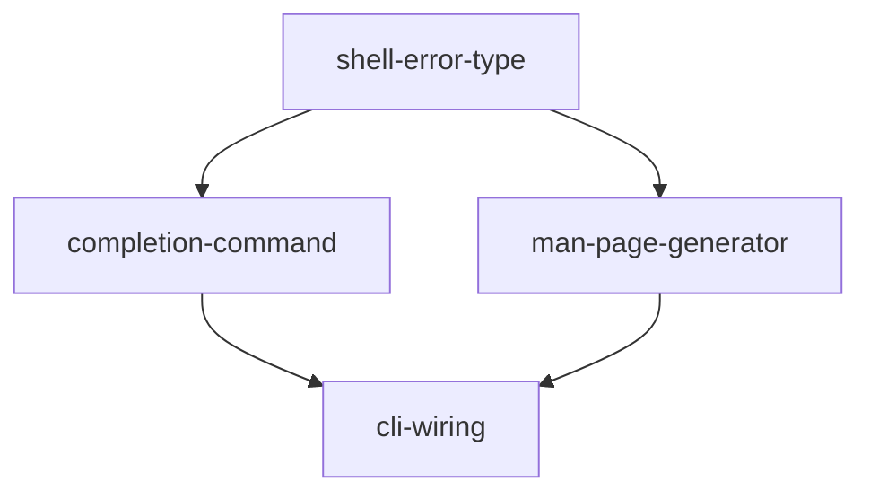

# Implementation Plan: Shell Integration (Rust)

**Feature ID**: FE-06
**Status**: planned
**Priority**: P2
**Target Language**: Rust 2021
**Source Spec**: `apcore-cli/docs/features/shell-integration.md`
**SRS Requirements**: FR-SHELL-001, FR-SHELL-002

---

## Goal

Port the Python `shell` feature (FE-06) to Rust. The Rust implementation must provide `completion` and `man` as first-class clap subcommands registered on the root CLI via `register_shell_commands`. Shell completion output is generated by `clap_complete` (already in `Cargo.toml`). Man pages are emitted as roff-formatted text built from a static template with dynamic program name and version. Both subcommands are pure output commands: they write to stdout and exit 0, or write to stderr and exit 2 on invalid input.

**Correctness invariants that must be preserved across the port:**

- `completion <shell>` accepts exactly `bash`, `zsh`, `fish`, `elvish`, `powershell`. Any other value is rejected by clap `PossibleValuesParser` at parse time — exit 2, no handler runs.
- `clap_complete::generate()` writes the completion script for the selected shell to a `Vec<u8>` buffer then prints to stdout.
- `man <command>` looks up the named subcommand in the root clap `Command`. Unknown command → stderr `"Error: Unknown command '{command}'."`, exit 2.
- Man page roff output must contain `.TH`, `.SH NAME`, `.SH SYNOPSIS`, `.SH EXIT CODES`. Section content is dynamically derived from the clap `Command` metadata (name, about, args).
- `register_shell_commands` follows the project's clap v4 builder idiom: accepts and returns `Command` (not `&mut Command`).

---

## Architecture Design

### Python → Rust Mapping

| Python (click) | Rust (clap v4) |
|----------------|----------------|
| `@cli.command("completion")` | `Command::new("completion")` added via `register_shell_commands` |
| `@click.argument("shell", type=click.Choice([...]))` | `Arg::new("shell").value_parser(PossibleValuesParser::new([...]))` |
| `click.echo(generators[shell]())` | `clap_complete::generate(shell_gen, &mut cmd, prog, &mut stdout)` |
| `@cli.command("man")` | `Command::new("man")` added via `register_shell_commands` |
| `@click.argument("command")` | `Arg::new("command").required(true)` |
| `click.echo(f"Error: Unknown command '{command}'.", err=True); sys.exit(2)` | `eprintln!(...); std::process::exit(EXIT_INVALID_INPUT)` |
| `_generate_man_page(command_name, cmd, prog_name)` | `generate_man_page(command_name, cmd_opt, prog_name, version)` |
| `click.echo(roff)` | `print!("{}", roff)` |
| `_make_function_name(prog_name)` | Not needed — `clap_complete` handles naming internally |
| `_generate_bash_completion`, `_generate_zsh_completion`, `_generate_fish_completion` | Replaced entirely by `clap_complete::generate` — no hand-written scripts |

### Shell Target Strategy

The Python implementation hand-writes bash/zsh/fish scripts with dynamic module ID hooks. The Rust port uses `clap_complete` instead. This changes the completion behaviour: instead of embedding a runtime `apcore-cli list --format json | python3 -c ...` call in the script, completion candidates come from the static clap argument definitions. This is the correct trade-off for the Rust port because:

1. `clap_complete` is already listed in `Cargo.toml`.
2. The dynamic module ID hook is a bonus feature that can be added in a follow-up task once the registry is wired.
3. All five shells supported by `clap_complete` (`Bash`, `Zsh`, `Fish`, `Elvish`, `PowerShell`) are available at zero implementation cost.

The `completion` command therefore supports `bash`, `zsh`, `fish`, `elvish`, `powershell` (five values, not three).

### Man Page Strategy

The Python implementation uses `clap_mangen` or hand-written roff. This port uses hand-written roff construction because:

1. `clap_mangen` is not in `Cargo.toml`; adding it requires a `Cargo.toml` change.
2. The spec requires a specific set of sections (NAME, SYNOPSIS, EXIT CODES, ENVIRONMENT, SEE ALSO) that are fully deterministic — hand-written construction is straightforward and avoids the extra dependency.
3. The `generate_man_page` function mirrors the Python `_generate_man_page` logic: it derives the synopsis from clap `Arg` definitions and builds EXIT CODES from the fixed table in the spec.

`Cargo.toml` does not require any changes.

### `ShellError` — Return Instead of `process::exit`

Command handlers return `Result<String, ShellError>` rather than calling `std::process::exit` directly. The binary entry point converts errors to exit codes. This keeps handlers testable.

```rust
#[derive(Debug, thiserror::Error)]
pub enum ShellError {
    #[error("unknown command '{0}'")]
    UnknownCommand(String),
}
```

Exit code mapping:

| Error variant | Exit code |
|---------------|-----------|
| `ShellError::UnknownCommand` | 2 |

### `register_shell_commands` Signature

Following the clap v4 builder idiom used throughout this project:

```rust
pub fn register_shell_commands(cli: Command, prog_name: &str) -> Command
```

The caller chains: `cli.pipe(|c| register_shell_commands(c, prog_name))`.

The existing stub uses `&mut Command`. The task `cli-wiring` updates the signature and adjusts the call site in `main.rs` and `lib.rs`.

### `clap_complete` Integration

```rust
use clap_complete::{generate, Shell};
use std::io;

fn cmd_completion(shell: Shell, prog_name: &str, cmd: &mut clap::Command) {
    generate(shell, cmd, prog_name, &mut io::stdout());
}
```

The `Shell` enum is parsed from the argument string by clap itself via `value_parser(EnumValueParser::<Shell>::new())`. All valid shell names are handled natively — no manual match arm needed.

### Man Page Roff Construction

`generate_man_page` builds roff sections as a `Vec<String>` and joins with `"\n"`:

1. `.TH "{PROG}-{COMMAND}" "1" "{date}" "{prog} {version}" "{prog} Manual"`
2. `.SH NAME` — `{prog}-{command} \- {brief_description}`
3. `.SH SYNOPSIS` — built from clap `Arg` list: options with type annotation, required positionals without brackets, optional positionals with brackets.
4. `.SH DESCRIPTION` — `about` text from clap `Command` if present.
5. `.SH OPTIONS` — `.TP` for each `Arg` with `long` or `short`. Includes help text and default if present.
6. `.SH ENVIRONMENT` — static section with the four standard env vars from the spec.
7. `.SH EXIT CODES` — static table from the spec (10 entries).
8. `.SH SEE ALSO` — sibling man page references using `prog_name`.

### Module Layout

```
src/
  shell.rs    — ShellError, register_shell_commands, completion_command,
                man_command, cmd_completion, cmd_man, generate_man_page,
                build_synopsis, KNOWN_BUILTINS
tests/
  test_shell.rs — integration tests (replace all assert!(false) stubs)
```

No new source files. No `Cargo.toml` changes required.

### Key Data-Flow

```
CLI parse
  │
  ├── "completion" subcommand match
  │     ├── get shell: matches.get_one::<Shell>("shell")
  │     ├── get prog_name from Command metadata
  │     ├── clap_complete::generate(shell, &mut root_cmd, prog_name, &mut stdout)
  │     └── exit 0
  │
  └── "man" subcommand match
        ├── get command: matches.get_one::<String>("command")
        ├── look up subcommand in root_cmd.get_subcommands()
        ├── None + not in KNOWN_BUILTINS → eprintln!(...); exit 2
        ├── generate_man_page(command, cmd_opt, prog_name, version) → roff string
        ├── print roff to stdout
        └── exit 0
```

---

## Task Breakdown

### Dependency Graph



### Task List

| Task ID | Title | Estimate |
|---------|-------|----------|
| `shell-error-type` | Define `ShellError` enum and `KNOWN_BUILTINS` constant | ~0.5h |
| `completion-command` | Implement `completion_command` and `cmd_completion` using `clap_complete` | ~1.5h |
| `man-page-generator` | Implement `generate_man_page`, `build_synopsis`, and `cmd_man` | ~3h |
| `cli-wiring` | Implement `register_shell_commands`, update signature, wire into root CLI, replace all `assert!(false)` stubs in `tests/test_shell.rs` | ~1.5h |

---

## Risks and Considerations

### `register_shell_commands` Signature Change

**Risk**: The existing stub uses `fn register_shell_commands(cli: &mut Command, prog_name: &str)`. The project's clap v4 idiom requires `fn register_shell_commands(cli: Command, prog_name: &str) -> Command`. Changing the signature will break the current `lib.rs` re-export and any call site.

**Mitigation**: The `cli-wiring` task explicitly updates `lib.rs` (re-export), `tests/test_shell.rs` (callers), and `src/main.rs` (call site). There are no other known callers yet (the dispatcher is not wired). The plan documents the new signature so all tasks use it from the start.

### `clap_complete::generate` Requires a Mutable `Command`

**Risk**: `clap_complete::generate` takes `app: &mut clap::Command` to embed completion data. The root `Command` must be available at completion time.

**Mitigation**: `cmd_completion` accepts `cmd: &mut clap::Command` built from `create_cli()`. Tests call `create_cli()` to get a fresh `Command` before each invocation — this is not expensive and avoids shared-state issues.

### `clap_complete` Shell Enum Parsing

**Risk**: The `Shell` enum in `clap_complete` must be parsed from a string argument. If `clap_complete`'s `Shell` does not implement `clap::ValueEnum`, the `PossibleValuesParser` approach does not apply.

**Mitigation**: `clap_complete::Shell` implements `clap::ValueEnum` since `clap_complete` v4. The `completion_command` uses `value_parser(clap::value_parser!(Shell))` which gives free parse-time rejection of unknown shells with exit 2.

### Man Page Lookup Requires Root Command Access

**Risk**: The `man` handler must look up sibling subcommands in the root `Command`. At the time the handler runs, the root `Command` may not be accessible through clap's standard match arms.

**Mitigation**: Pass the root `Command` into `cmd_man` as a parameter. The dispatch site in `main.rs` holds a clone of the root command (built before `get_matches()` is called) and passes it to the handler. This is the same pattern documented in the clap v4 FAQ for "post-parse access to the Command tree".

### `std::process::exit` in Tests

**Risk**: If `cmd_man` calls `std::process::exit(2)` on unknown command, it terminates the test process.

**Mitigation**: `cmd_man` returns `Result<String, ShellError>`. The caller (main dispatch) maps `ShellError::UnknownCommand` to `eprintln!` + `std::process::exit(EXIT_INVALID_INPUT)`. Tests assert `Err(ShellError::UnknownCommand(_))` without process termination.

### Bash Syntax Validation

**Risk**: The Python tests validate the bash completion script with `bash -n`. Since `clap_complete` generates the bash script, this test is still useful but is an external process test (requires `bash` on the test host).

**Mitigation**: Add a `#[cfg(unix)]` test that shells out to `bash -n` with a temp file. The test is skipped on Windows. Mark it as an integration test in `tests/test_shell.rs`.

---

## Acceptance Criteria

All acceptance criteria from the Python feature spec (FE-06) apply where applicable, verified via `cargo test`.

| Test ID | Description | Expected |
|---------|-------------|----------|
| T-SHELL-01 | `completion bash` output | Non-empty bytes on stdout; exit 0 |
| T-SHELL-02 | `completion zsh` output | Non-empty bytes on stdout; exit 0 |
| T-SHELL-03 | `completion fish` output | Non-empty bytes on stdout; exit 0 |
| T-SHELL-04 | `completion invalid` | Clap rejects at parse time; exit 2 |
| T-SHELL-05 | `completion elvish` | Non-empty bytes on stdout; exit 0 (Rust extension beyond Python) |
| T-SHELL-06 | `man exec` | Roff with `.TH`, `.SH NAME`, `.SH SYNOPSIS`, `.SH EXIT CODES`; exit 0 |
| T-SHELL-07 | `man list` | Roff output for `list` command; exit 0 |
| T-SHELL-08 | `man nonexistent` | stderr `"Error: Unknown command 'nonexistent'."`, exit 2 |
| T-SHELL-09 | `man exec` EXIT CODES section | Contains all 10 exit codes from spec |
| T-SHELL-10 | `man exec` ENVIRONMENT section | Contains `APCORE_EXTENSIONS_ROOT` and `APCORE_CLI_LOGGING_LEVEL` |
| T-SHELL-11 | `register_shell_commands` called | Root has `completion` and `man` subcommands |
| T-SHELL-12 | Bash script syntax check | `bash -n <(completion bash output)` exits 0 (unix only) |

Additional Rust-specific criteria:

- `cargo test` passes with zero `assert!(false, "not implemented")` assertions in `src/shell.rs` and `tests/test_shell.rs`.
- `cargo clippy -- -D warnings` produces no warnings in `src/shell.rs`.
- `cargo build --release` succeeds.
- No `todo!()` macros remain in `src/shell.rs`.

---

## References

- Feature spec: `/Users/tercel/WorkSpace/aiperceivable/apcore-cli/docs/features/shell-integration.md`
- Python implementation: `/Users/tercel/WorkSpace/aiperceivable/apcore-cli-python/src/apcore_cli/shell.py`
- Python planning: `/Users/tercel/WorkSpace/aiperceivable/apcore-cli-python/planning/shell-integration.md`
- Type mapping spec: `/Users/tercel/WorkSpace/aiperceivable/apcore/docs/spec/type-mapping.md`
- Existing stub: `/Users/tercel/WorkSpace/aiperceivable/apcore-cli-rust/src/shell.rs`
- Existing test stub: `/Users/tercel/WorkSpace/aiperceivable/apcore-cli-rust/tests/test_shell.rs`
- Discovery plan (pattern reference): `/Users/tercel/WorkSpace/aiperceivable/apcore-cli-rust/planning/discovery/plan.md`
- `clap_complete` v4 docs: https://docs.rs/clap_complete/latest/clap_complete/
- `clap` v4 docs: https://docs.rs/clap/latest/clap/
